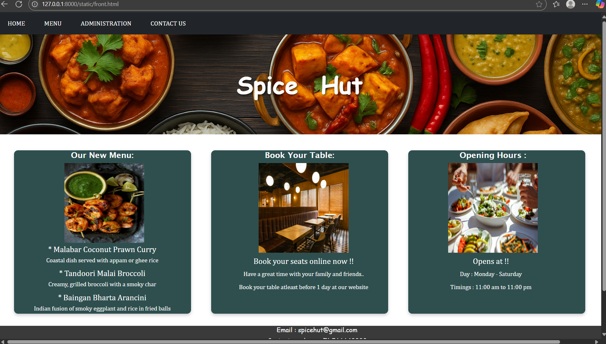
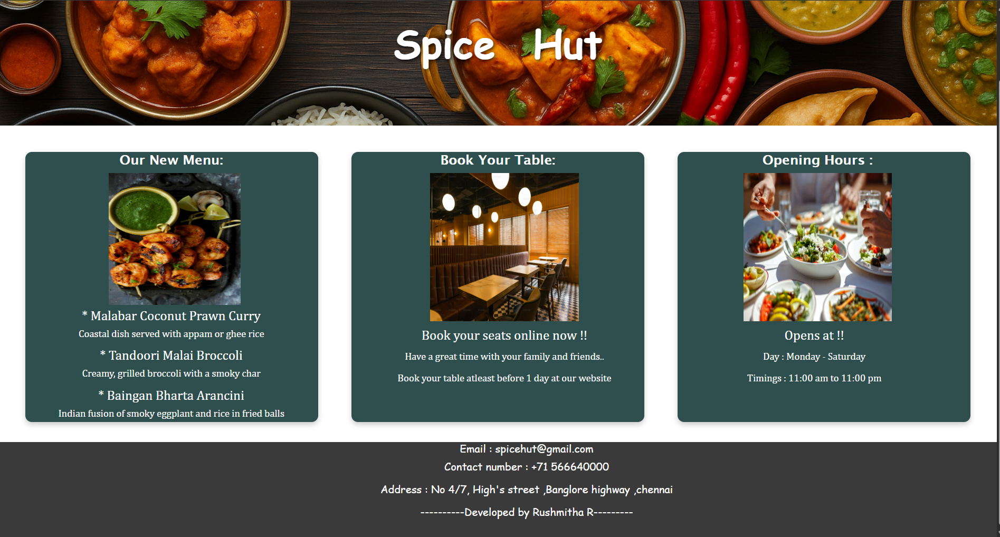
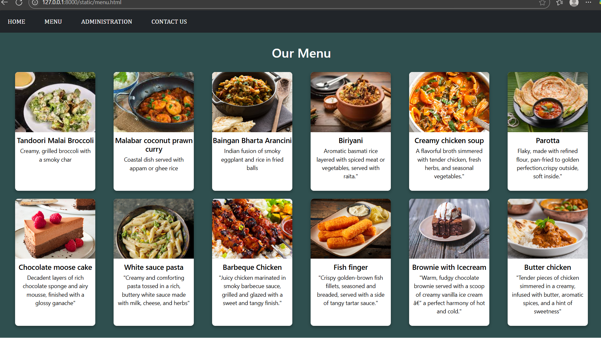
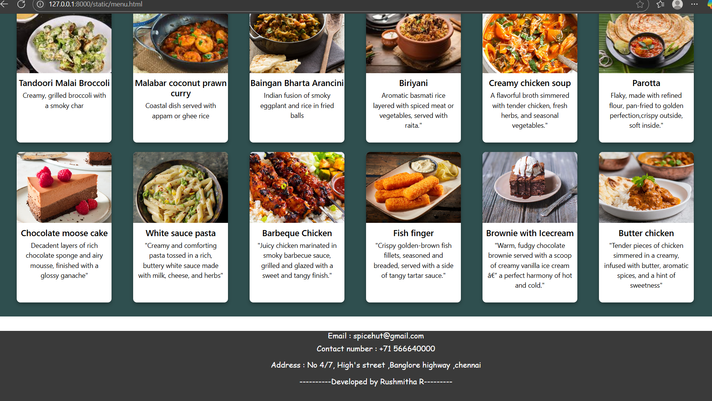
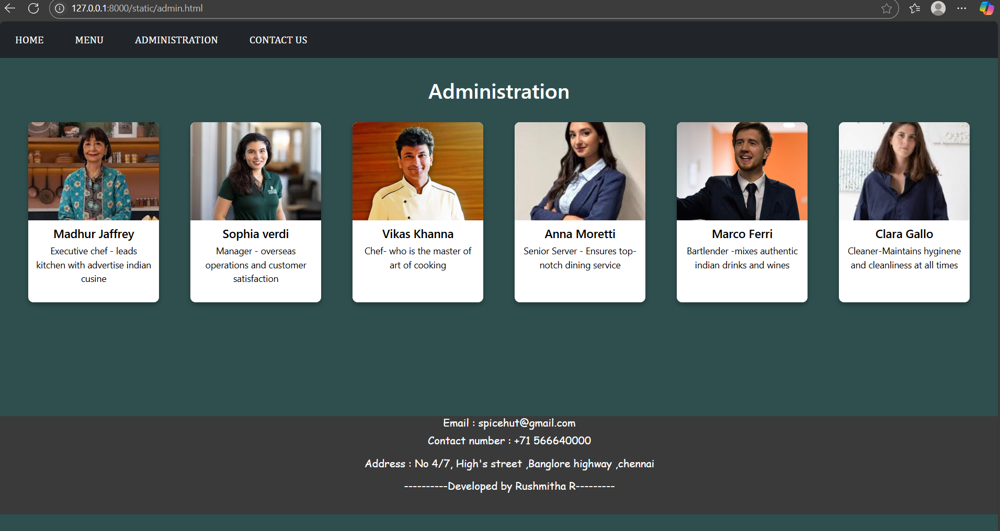
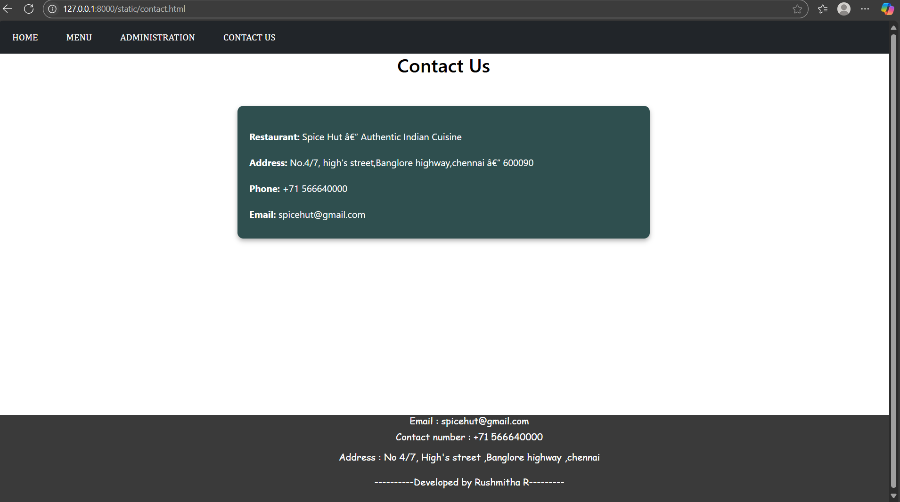

# Ex.07 Restaurant Website
## Date:15/05/2025

## AIM:
To develop a static Restaurant website to display the food items and services provided by them.

## DESIGN STEPS:

### Step 1:
Requirement collection.

### Step 2:
Creating the layout using HTML and CSS.

### Step 3:
Updating the sample content.

### Step 4:
Choose the appropriate style and color scheme.

### Step 5:
Validate the layout in various browsers.

### Step 6:
Validate the HTML code.

### Step 7:
Publish the website in the given URL.

## PROGRAM:
```
front.html

<html>
<head>
    <link href="design.css" rel="stylesheet">
    <link href="https://cdn.jsdelivr.net/npm/bootstrap@5.3.3/dist/css/bootstrap.min.css" rel="stylesheet">        
    <script src="https://cdn.jsdelivr.net/npm/bootstrap@5.3.3/dist/js/bootstrap.bundle.min.js">
    </script>
  
  <title>Spice Hut</title>
  <style>
    
    .navi
    {
        font-family: Cambria, Cochin, Georgia, Times, 'Times New Roman', serif;

    }

    .banner {
      background-image: url('TOP.png'); 
      background-size: cover;
      background-position: center;
      height: 250px;
      position: relative;
      display: flex;
      align-items: center;
      justify-content: center;
      color: white;
      text-shadow: 2px 2px 6px rgba(0, 0, 0, 0.7);
      word-spacing: 30;
    }

    .banner h1 {

      font-family:cursive;
      font-size: 60px;
      margin: 0;
      font-weight: bold;
    }
    
    
    
    .box-section {
  display: flex;
  flex-direction: row;     /* Horizontal layout */
  justify-content: flex-start;
  gap: 50px;               /* Space between the boxes */
  margin-top: 40px;        /* Top margin from banner */
  margin-left: 40px;   
  margin-right: 40px;    /* Left margin from the edge */
}

.info-box {
  background-color:darkslategrey;
  color: white;
  width: 800px;
  height: 410px;
  display: flex;
  font-family: Cambria, Cochin, Georgia, Times, 'Times New Roman', serif;
  border-radius: 10px;
  font-size: 20px;
  box-shadow: 0 4px 8px rgba(0, 0, 0, 0.2);
  
}
.menu-content h3 {
  margin-left: 50;
  font-size: 20px;
  margin-bottom: 4px;

}
.menu-content h2 {
  margin-left: 50;
  font-size: 20px;
  margin: top 2px;
  font-family:'Lucida Sans', 'Lucida Sans Regular', 'Lucida Grande', 'Lucida Sans Unicode', Geneva, Verdana, sans-serif;

}


.menu-content p {
  margin-left: 50;
  font-size: 15px;
  margin-bottom: 10px;
  font-weight: normal;
}
.image
{
  margin-left: 60;
 
}
  </style>
</head>
<body>
    <div class="navi">
    <nav class="navbar navbar-expand-sm bg-dark">
            <ul class="navbar-nav">
                <li class="nav-item bg-dark mx-3">
                    <a class="nav-link text-white" href="front.html">HOME</a>
                </li>
                <li class="nav-item bg-dark mx-3">
                    <a class="nav-link text-white" href="menu.html">MENU</a>

                </li>
                <li class="nav-item bg-dark mx-3">
                    <a class="nav-link text-white" href="admin.html">ADMINISTRATION</a>
                </li>
                <li class="nav-item bg-dark mx-3">
                    <a class="nav-link text-white" href="contact.html">CONTACT US</a>
                </li>

            </ul>
        </nav>
    </div>

  <div class="banner">
    <h1>Spice   Hut</h1> 
  </div>
  
    <div class="box-section">
        <div class="info-box">
          <div class="menu-content">
            <center>
              <h2 ">Our New Menu:</h2>
                
              
                <br>

              <h3 style="margin-top: 4;">*  Malabar Coconut Prawn Curry</h3>
              <p>Coastal dish served with appam or ghee rice</p>

              <h3 style="margin-top: 4;">*  Tandoori Malai Broccoli</h3>
              <p>Creamy, grilled broccoli with a smoky char</p>

              <h3>*  Baingan Bharta Arancini</h3>
              <p>Indian fusion of smoky eggplant and rice in fried balls</p>
            </center>
          </div>
        </div>
          
          
        <div class="info-box">
          <div class="menu-content">
            <center>
              <h2 style="margin-left: 50 ;">Book Your Table:</h2>
              
              <br>
              <h3 style="margin-top: 9;margin-left: 70;">  Book your seats online now !!</h3>
              <p style="margin-top: 9;margin-left: 70;">Have a great time with your family and friends..</p>
              <p style="margin-top: 9;margin-left: 70;">Book your table atleast before 1 day at our website</p>
            </center>
          </div>
        </div>
        <div class="info-box">
          <div class="menu-content">
            <center>
              <h2 style="margin-left:100;">Opening Hours :</h2>
              
              <br>
             
              <h3 style="margin-top: 9;margin-left: 90;">  Opens at !!</h3>
              <p style="margin-top: 9;margin-left: 90;">Day : Monday - Saturday</p>
              <p style="margin-top: 9;margin-left: 90;">Timings : 11:00 am to 11:00 pm</p>

            </center>
          </div>
        </div>
        
        
      </div>
    
</body>
<footer style="background-color:rgb(58, 58, 58);height: 150;width: 1600px;color: white;text-align: center;font-family: cursive;font-size: 5;margin-top:30;">
    <h2 style="font-size:medium; margin-top: 4;">Email : spicehut@gmail.com </h2> <h2 style="font-size:medium;">Contact number : +71 566640000</h2><br>
    <h2 style="font-size:medium;">Address  : No 4/7, High's street ,Banglore highway ,chennai</h2>
    <br>
    <h2 style="font-size:medium;">----------Developed by Rushmitha R--------- </h2>
</footer>

</html>


menu.html

<html>
<head>
    <link href="design.css" rel="stylesheet">
    <link href="https://cdn.jsdelivr.net/npm/bootstrap@5.3.3/dist/css/bootstrap.min.css" rel="stylesheet">        
    <script src="https://cdn.jsdelivr.net/npm/bootstrap@5.3.3/dist/js/bootstrap.bundle.min.js">
    </script>
  
  <title>Menu Spice Hut</title>
  <style>
    .navi
    {
        font-family: Cambria, Cochin, Georgia, Times, 'Times New Roman', serif;

    }
    .menu-section {
  background-color:darkslategrey;
  padding: 30px;
  color: #fff;
  text-align: center;
}

    .menu-title {
  color: white;
  font-size: 32px;
  margin-bottom: 30px;
}

    .menu-grid {
  display: grid;
  grid-template-columns: repeat(auto-fit, minmax(200px, 1fr));
  gap: 20px;
  justify-items: center;
}

    .menu-card {
  background-color: white;
  color: black;
  border-radius: 8px;
  overflow: hidden;
  width: 200px;
  box-shadow: 0 4px 8px rgba(0,0,0,0.3);
  text-align: center;
}

    .menu-card img {
  width: 100%;
  height: 150px;
  object-fit: cover;
}

    .menu-card h3 {
  font-size: 18px;
  margin: 10px 0 5px;
}

    .menu-card p {
  font-size: 14px;
  padding: 0 10px 10px;
}

  </style>

</head>
<body>
    <div class="navi">
    <nav class="navbar navbar-expand-sm bg-dark">
            <ul class="navbar-nav">
                <li class="nav-item bg-dark mx-3">
                    <a class="nav-link text-white" href="front.html">HOME</a>
                </li>
                <li class="nav-item bg-dark mx-3">
                    <a class="nav-link text-white" href="menu.html">MENU</a>

                </li>
                <li class="nav-item bg-dark mx-3">
                    <a class="nav-link text-white" href="admin.html">ADMINISTRATION</a>
                </li>
                <li class="nav-item bg-dark mx-3">
                    <a class="nav-link text-white" href="contact.html">CONTACT US</a>
                </li>

            </ul>
        </nav>
    </div>
    <div class="menu-section">
  <h2 class="menu-title">Our Menu</h2>
  <div class="menu-grid">
    <div class="menu-card">
      
      <h3>Tandoori Malai Broccoli</h3>
      <p>Creamy, grilled broccoli with a smoky char</p>
    </div>
    <div class="menu-card">
      
      <h3>Malabar coconut prawn curry</h3>
      <p>Coastal dish served with appam or ghee rice</p>
    </div>
    <div class="menu-card">
      
      <h3>Baingan Bharta Arancini</h3>
      <p>Indian fusion of smoky eggplant and rice in fried balls</p>
    </div>
    <div class="menu-card">
      
      <h3>Biriyani</h3>
      <p>Aromatic basmati rice layered with spiced meat or vegetables, served with raita."

</p>
    </div>
    <div class="menu-card">
      
      <h3>Creamy chicken soup</h3>
      <p>A flavorful broth simmered with tender chicken, fresh herbs, and seasonal vegetables."</p>
    </div>
    <div class="menu-card">
      
      <h3>Parotta</h3>
      <p>Flaky, made with refined flour, pan-fried to golden perfection,crispy outside, soft inside."</p>
    </div>
    <div class="menu-card">
      
      <h3>Chocolate moose cake</h3>
      <p>Decadent layers of rich chocolate sponge and airy mousse, finished with a glossy ganache"</p>
    </div>
    <div class="menu-card">
      
      <h3>White sauce pasta</h3>
      <p>"Creamy and comforting pasta tossed in a rich, buttery white sauce made with milk, cheese, and herbs"</p>
    </div>
    <div class="menu-card">
      
      <h3>Barbeque Chicken</h3>
      <p>"Juicy chicken marinated in smoky barbecue sauce, grilled and glazed with a sweet and tangy finish."</p>
    </div>
    <div class="menu-card">
      
      <h3>Fish finger</h3>
      <p>"Crispy golden-brown fish fillets, seasoned and breaded, served with a side of tangy tartar sauce."</p>
    </div>
    <div class="menu-card">
      
      <h3>Brownie with Icecream</h3>
      <p>"Warm, fudgy chocolate brownie served with a scoop of creamy vanilla ice cream — a perfect harmony of hot and cold."</p>
    </div>
    <div class="menu-card">
      
      <h3>Butter chicken</h3>
      <p>"Tender pieces of chicken simmered in a creamy, infused with butter, aromatic spices, and a hint of sweetness"</p>
    </div>
  </div>
</div>
</body>
<footer style="background-color:rgb(58, 58, 58);height: 150;width: 1600px;color: white;text-align: center;font-family: cursive;font-size: 5;margin-top:30;">
    <h2 style="font-size:medium; margin-top: 4;">Email : spicehut@gmail.com </h2> <h2 style="font-size:medium;">Contact number : +71 566640000</h2><br>
    <h2 style="font-size:medium;">Address  : No 4/7, High's street ,Banglore highway ,chennai</h2>
    <br>
    <h2 style="font-size:medium;">----------Developed by Rushmitha R--------- </h2>
</footer>
</html>


admin.html


<html>
<head>
    <link href="design.css" rel="stylesheet">
    <link href="https://cdn.jsdelivr.net/npm/bootstrap@5.3.3/dist/css/bootstrap.min.css" rel="stylesheet">        
    <script src="https://cdn.jsdelivr.net/npm/bootstrap@5.3.3/dist/js/bootstrap.bundle.min.js">
    </script>
  
  <title>Administration Spice Hut</title>
  <style>
    .navi
    {
        font-family: Cambria, Cochin, Georgia, Times, 'Times New Roman', serif;

    }
    .menu-section {
  background-color:darkslategrey;
  padding: 30px;
  color: #fff;
  text-align: center;
}

    .menu-title {
  color: white;
  font-size: 32px;
  margin-bottom: 30px;
}

    .menu-grid {
  display: grid;
  grid-template-columns: repeat(auto-fit, minmax(200px, 1fr));
  gap: 20px;
  justify-items: center;
}

    .menu-card {
  background-color: white;
  color: black;
  border-radius: 8px;
  overflow: hidden;
  width: 200px;
  box-shadow: 0 4px 8px rgba(0,0,0,0.3);
  text-align: center;
}

    .menu-card img {
  width: 100%;
  height: 150px;
  object-fit: cover;
}

    .menu-card h3 {
  font-size: 18px;
  margin: 10px 0 5px;
}

    .menu-card p {
  font-size: 14px;
  padding: 0 10px 10px;
}

  </style>

</head>
<body>
    <div class="navi">
    <nav class="navbar navbar-expand-sm bg-dark">
            <ul class="navbar-nav">
                <li class="nav-item bg-dark mx-3">
                    <a class="nav-link text-white" href="front.html">HOME</a>
                </li>
                <li class="nav-item bg-dark mx-3">
                    <a class="nav-link text-white" href="menu.html">MENU</a>

                </li>
                <li class="nav-item bg-dark mx-3">
                    <a class="nav-link text-white" href="admin.html">ADMINISTRATION</a>
                </li>
                <li class="nav-item bg-dark mx-3">
                    <a class="nav-link text-white" href="contact.html">CONTACT US</a>
                </li>

            </ul>
        </nav>
    </div>
    <div class="menu-section">
  <h2 class="menu-title">Administration</h2>
  <div class="menu-grid">
    <div class="menu-card">
      
      <h3>Madhur Jaffrey</h3>
      <p>Executive chef - leads kitchen with advertise indian cusine</p>
    </div>
    <div class="menu-card">
      
      <h3>Sophia verdi</h3>
      <p>Manager - overseas operations and customer satisfaction</p>
    </div>
    <div class="menu-card">
      
      <h3>Vikas Khanna</h3>
      <p>Chef- who is the master of art of cooking</p>
    </div>
    <div class="menu-card">
      
      <h3>Anna Moretti</h3>
      <p>Senior Server - Ensures top-notch dining service

</p>
    </div>
    <div class="menu-card">
      
      <h3>Marco Ferri</h3>
      <p>Bartlender -mixes authentic indian drinks and wines</p>
    </div>
    <div class="menu-card">
      
      <h3>Clara Gallo</h3>
      <p>Cleaner-Maintains hyginene and cleanliness at all times</p>
    </div>
</div>
</body>
    <footer style="background-color:rgb(58, 58, 58);height: 150;width: 1600px;color: white;text-align: center;font-family: cursive;font-size: 5;margin-top: 175;margin-left: -50;">
    <h2 style="font-size:medium; margin-top: 4;">Email : spicehut@gmail.com </h2> <h2 style="font-size:medium;">Contact number : +71 566640000</h2><br>
    <h2 style="font-size:medium;">Address  : No 4/7, High's street ,Banglore highway ,chennai</h2>
    <br>
    <h2 style="font-size:medium;">----------Developed by Rushmitha R--------- </h2>
</footer>
</html>


contact.html


<html>
<head>
    <link href="design.css" rel="stylesheet">
    <link href="https://cdn.jsdelivr.net/npm/bootstrap@5.3.3/dist/css/bootstrap.min.css" rel="stylesheet">        
    <script src="https://cdn.jsdelivr.net/npm/bootstrap@5.3.3/dist/js/bootstrap.bundle.min.js">
    </script>
  
    <title>Contact us Spice Hut</title>
    <style>
    .navi
    {
        font-family: Cambria, Cochin, Georgia, Times, 'Times New Roman', serif;

    }
    .contact-section h1 {
    font-size: 32px;
    color:black;
    margin-bottom: 30px;
    text-align-last: center;
    
}

.contact-box {
    background-color:darkslategrey;
    color:white;
    padding: 20px;
    margin: 0 auto;
    width: 700px;
    border-radius: 10px;
    box-shadow: 0 4px 8px rgba(0,0,0,0.3);
    margin-top: 50;
}

.contact-box p {
    font-size: 16px;
    margin: 10px 0;
    margin-top: 20;
}
    </style>
</head>
<body>
    <div class="navi">
    <nav class="navbar navbar-expand-sm bg-dark">
            <ul class="navbar-nav">
                <li class="nav-item bg-dark mx-3">
                    <a class="nav-link text-white" href="front.html">HOME</a>
                </li>
                <li class="nav-item bg-dark mx-3">
                    <a class="nav-link text-white" href="menu.html">MENU</a>

                </li>
                <li class="nav-item bg-dark mx-3">
                    <a class="nav-link text-white" href="admin.html">ADMINISTRATION</a>
                </li>
                <li class="nav-item bg-dark mx-3">
                    <a class="nav-link text-white" href="contact.html">CONTACT US</a>
                </li>

            </ul>
        </nav>
    </div>
    <div class="contact-section">
        <h1>Contact Us</h1>
        <div class="contact-box">
            <p><strong>Restaurant:</strong> Spice Hut – Authentic Indian Cuisine</p>
            <p><strong>Address:</strong> No.4/7, high's street,Banglore highway,chennai – 600090</p>
            <p><strong>Phone:</strong> +71 566640000</p>
            <p><strong>Email:</strong> spicehut@gmail.com</p>
        </div>
    </div>
    

</body>
<footer style="background-color:rgb(58, 58, 58);height: 150;width: 1600px;color: white;text-align: center;font-family: cursive;font-size: 5;margin-top:300;">
    <h2 style="font-size:medium; margin-top: 4;">Email : spicehut@gmail.com </h2> <h2 style="font-size:medium;">Contact number : +71 566640000</h2><br>
    <h2 style="font-size:medium;">Address  : No 4/7, High's street ,Banglore highway ,chennai</h2>
    <br><br>
    <h2 style="font-size:medium;">----------Developed by Rushmitha R--------- </h2>
</footer>
</html>


```


## OUTPUT:













## RESULT:
The program for designing software company website using HTML and CSS is completed successfully.
